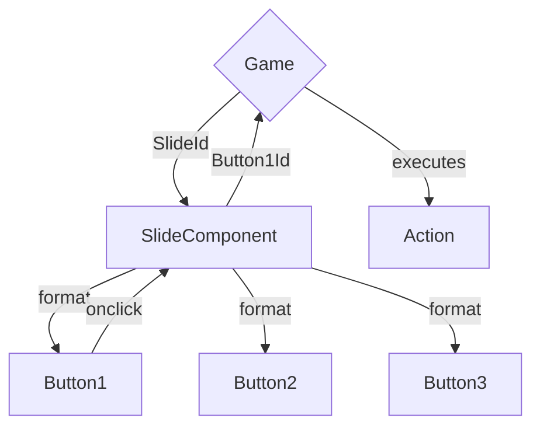

# Structure

## Communication



## Folder Structure

```plaintext
Pages
    Index.razor
    Game.razor

Shared
    Slides
        Slide.razor
        Slide.razor.css
        SlideBase.cs
    [Folders for custom slides]

Data
    Slides.json // contains the definition of the slides, with buttons and all that
    GameState.json
    (Inventory.json if not merged with GameState.json)

wwwroot
    Images
        SlideId
            Image.whatever-extension-we-will-chose
            [Other slide specific images, like for special buttons or stuff like that]
            [Maybe also everything in one big folder, depending on the amount of images we have]

    Sounds
        [Idk about the structure, depends if we have a lot of sounds or not]

    [Other stuff, fonts or whatever, we'll see if we need it (I also don't know where to put certain things, so we'll have to figure that out along the way)]
```

## Data Storage

### Slides.json

```json
{
    "SlideId": {
        "Image": "Path/To/Image",
        "Buttons" : {
            "ButtonId": {
                "Points": "Points" || "x,y,width,height",
                "Image": "Path/To/Image",
                "Actions": [
                    ["ActionType", "ActionArgs"]
                    general syntax, if more than one arg is needed, we'll switch the args to a list
                    ["Require", ["ItemId", "HintText"]]
                    ["InventoryAdd", "ItemId"],
                    ["InventoryRemove", "ItemId"],
                    ["Sound", "SoundId"],
                    ["Route", "SlideId"],
                    // ["Method", "MethodName"] // a bit risky and error-prone, but it could be a possobility
                ]
            },
            ...
        }
    },
...
}
```

If "Image" is null, the button will be a polygon and the "Points" property will be used accordingly.

If "Image" is not null, the button will be an image and the "Points" property will define x, y, width, height of the image. As not all of the attributes are needed, the syntax is a bit different. The values are comma seperated in the order x, y, width, height. If a value is not needed, just put an empty string in its place. For example, if you only want to define the width and height, but not the x and y, the syntax would be " , , width, height".

Examples:

-   `Points: "13, , 60, "` only x, and width
-   `Points: " , 13, , 60"` only y, and height
-   `Points: "13, 13, , "` only x, y
-   `Points: " , , 60, 60"` only width, height
-   `Points: "13, 13, 60, 60"` all values

Some Actions I think we'll need:

-   `Route(SlideId)` - changes to the specified slide
-   `InventoryAdd(ItemId)` - adds the specified item to the inventory
-   `InventoryRemove(ItemId)` - removes the specified item from the inventory
-   `Sound(SoundId)` - plays the specified sound
-   `Require(ItemId, HintText)` - requires the specified item to be in the inventory, if it isn't, a hint is displayed
-   `ToggleVisibility(ButtonId)` - toggles the visibility of the specified button

### Deserialization of Slides.json

I think it is best to have two classes for the json deserializer:

-   Slides
-   Slide
-   Button <br>
    (maybe Action, but that could be overcomplicating things unnecessarily)

```csharp

// I don't know enough about json deserialization in C#, but I think you'll get the idea

class Button
{
    public string Id { get; set; }
    public string? Points { get; set; }
    public string? Image { get; set; }
    public List<List<string>> Actions { get; set; }
    // public List<Action> Actions { get; set; } // If we decide to implement actions as a class
}

class Slide
{
    public string Image { get; set; }
    public List<Button> Buttons { get; set; }
}

class Slides
{
    public Dictionary<string, Slide> Slides { get; set; }
}
```

### SlideBase.cs

A basic class for all the slides, that contains enough functionality for a standard slide to function without any additional code and just the SlideId.
Any custom slide will be a child of this class and can override/expand the functionality.

```csharp

class SlideBase : ComponentBase
{
    [Parameter]
    public string SlideId { get; set; }

    public Slide Slide { get; set; }

    protected override void OnInitialized()
    {
        // load the slide from the json file
        Slide = Slides[SlideId]; // Something like that, idk how it works exactly
    }

    public void ButtonClick(string buttonId)
    {
        // execute the actions of the button
        foreach (var action in Slide.Buttons[buttonId].Actions)
        {
            ExecuteAction(action);
        }
    }

    // idk exactly, but something like that I guess
    public void ExecuteAction(List<string> args)
    {
        // execute actions accordingly
        switch (args[0])
        {
            case "Route":
                Route(args[1]); // maybe also have the full code in here, depends on the size of the method
                break;
            ... // other actions
        }
    }
}

```

### ButtonBase.cs?

I don't know if this is needed, but I'll just throw the idea into the room. Maybe we could use it, but it really depends on how we implement everything, so we'll see.

### GameState.json (not sure about the structure yet)

```json

{
    // every object that changes state during the game has an entry here
    // can be used to export saves
    // not sure about the structure yet
    "Visibilities": {
        "ButtonId": true,
        "ButtonId2": false,
        ...
    },

}

```
