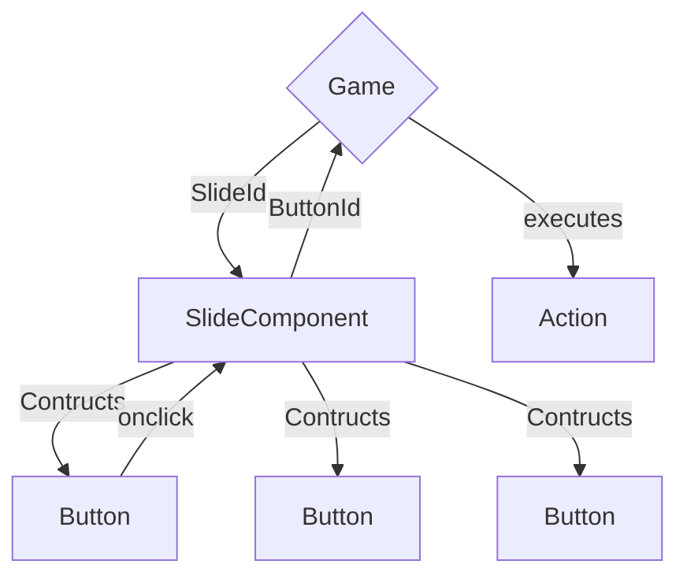

# Structure

## Communication



## Folder Structure

```plaintext
Pages
    Index.razor
    Game.razor

Shared
    Slides
        Slide.razor
        Slide.razor.css
        SlideBase.cs
    [Folders for custom slides]

Data
    Slides.json // contains the definition of the slides, with buttons and all that
    GameState.json
    (Inventory.json if not merged with GameState.json)

wwwroot
    Images
        [Images for slides, in folders or not, don't know yet]

```

## Data Storage

### Slides.json

```json
{
    "SlideId": {
        "Image": "Path/To/Image",
        "Buttons": [
            {
                "Id": "ButtonId",
                "Points": "Points",
                "Image": ["Path/To/Image", "Size"], // points and image are mutually exclusive
                "Actions": [
                    ["Action", "Arg"], // possibly more than one arg, just use lists then
                    ["Action", "Arg"], // multiple actions should be executed consecutively
                    ["Route", "SlideId"] // probably most common action
                    ...
                ]
            },
        ...
        ]
    },
...
}
```

### GameState.json (not sure about the structure yet)

```json

{
    // every object that changes state during the game has an entry here
    // not sure about the structure yet
    // can be used to export saves
    "Visibilities": {
        "ButtonId": true,
        "ButtonId2": false,
        ...
    },

}

```
