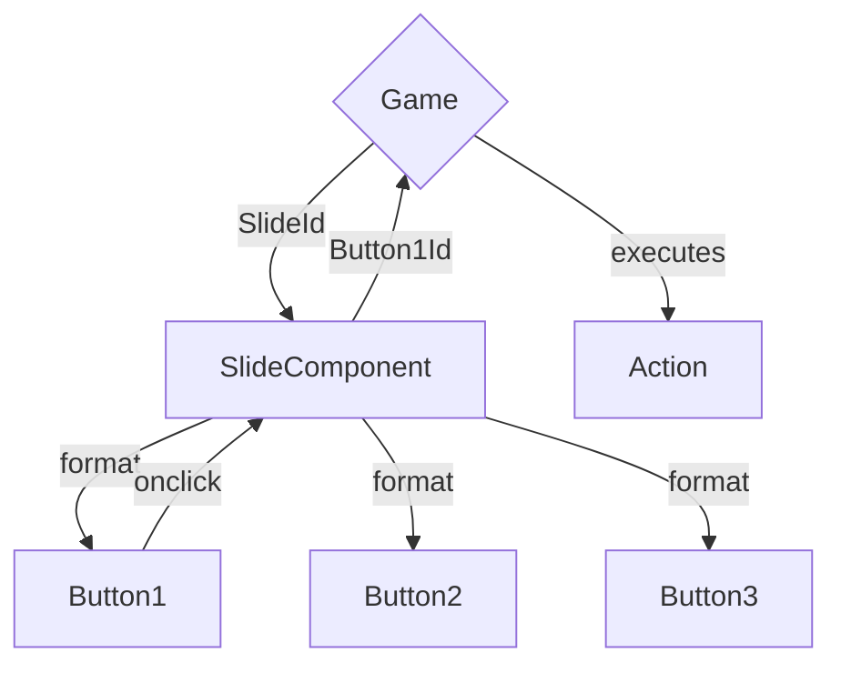

# Structure

## Communication



## Folder Structure

```plaintext
Pages
    Index.razor
    Game.razor

Shared
    Slides
        Slide.razor
        Slide.razor.css
        SlideBase.cs
    [Folders for custom slides]

Data
    Slides.json // contains the definition of the slides, with buttons and all that
    GameState.json
    (Inventory.json if not merged with GameState.json)

wwwroot
    Images
        SlideId
            Image.whatever-extension-we-will-chose
            [Other slide specific images, like for special buttons or stuff like that]
            [Maybe also everything in one big folder, depending on the amount of images we have]

    Sounds
        [Idk about the structure, depends if we have a lot of sounds or not]

    [Other stuff, fonts or whatever, we'll see if we need it (I also don't know where to put certain things, so we'll have to figure that out along the way)]
```

## Data Storage

### Slides.json

```json
{
    "SlideId": {
        "Image": "Path/To/Image",
        "Buttons": [
            {
                "Id": "ButtonId",
                "Points": "Points",
                "Image": ["Path/To/Image", "Pos(top, left, width, height)"], // points and image are mutually exclusive
                // some examples of actions
                "Actions": [
                    ["ActionType", "ActionArgs"], // general syntax, if more than one arg is needed, we'll switch the args to a list
                    ["Require", ["ItemId", "HintText"]]
                    ["InventoryAdd", "ItemId"],
                    ["InventoryRemove", "ItemId"],
                    ["Sound", "SoundId"],
                    ["Route", "SlideId"],
                    // ["Method", "MethodName"] // a bit risky and error-prone, but it could be a possobility
                    ...
                ]
            },
        ...
        ]
    },
...
}
```

Some Actions I think we'll need:

-   `Route(SlideId)` - changes to the specified slide
-   `InventoryAdd(ItemId)` - adds the specified item to the inventory
-   `InventoryRemove(ItemId)` - removes the specified item from the inventory
-   `Sound(SoundId)` - plays the specified sound
-   `Require(ItemId, HintText)` - requires the specified item to be in the inventory, if it isn't, a hint is displayed
-   `ToggleVisibility(ButtonId)` - toggles the visibility of the specified button

### GameState.json (not sure about the structure yet)

```json

{
    // every object that changes state during the game has an entry here
    // can be used to export saves
    // not sure about the structure yet
    "Visibilities": {
        "ButtonId": true,
        "ButtonId2": false,
        ...
    },

}

```
