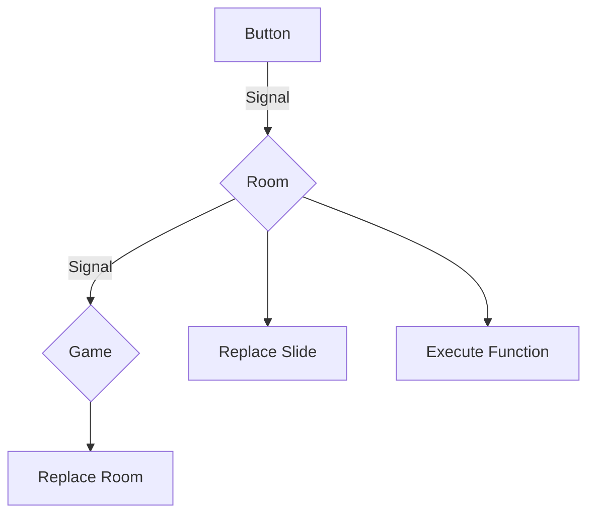

# AdventureFramework2023

# TODO for Holidays

### Slides

-   Slides.json - giant file with data in it, described in ProjectStructure.md
-   Slide.razor - component that takes an id and gets the data from Slides.json and displays accordingly, also with checking for visibility of certain buttons in GameState.json
-   SlideBase.cs - base class for Slide.razor, contains the logic
-   If a button was clicked, raise an event with the button id

### Game

-   Game.razor - component that contains the current slide and the inventory
-   GameBase.cs - base class for Game.razor, contains the logic
-   If a button was clicked, execute the actions that are in the Slides.json for this button

### Other

-   Methods for the actions that can be triggered by buttons
-   Some function that checks the Slides.json and GameState.json for obvious errors such as typos and stuff (not strictly neccessary, but would make our life easier, especially of others contribute)

Possible actions:

-   MethodName - args
-   Route - SlideId
-   (Iventory - ItemId, Add/Remove)
-   InventoryAdd - ItemId
-   InventoryRemove - ItemId
-   Sound - SoundId

## More detailed info in ProjectStructure.md

# Tasks

To sum up the tasks we have to do:

Slide (Jona?):

-   Slide takes SlideId and "constructs" itself with all buttons from Slides.json (and GameState.json for visibility and such)
-   Slide raises event with ButtonId when a button is clicked

Communication (Laurin?):

-   Game takes ButtonId and executes actions accordingly
-   "JSON-Checker" (checks for obvious errors in the big json files)

Other (Dimitri?):

-   A bunch of functions for actions; i.e. Inventory, Sound, GameState update, etc.

<br>
<br>
<br>
<br>
<br>
<br>
<br>
<br>
<br>
<br>
<br>
<br>
<br>
<br>
<br>
<br>
<br>
<br>
<br>
<br>
<br>
<br>
<br>
<br>
<br>
<br>
<br>
<br>
<br>
<br>
<br>
<br>
<br>
<br>
<br>
<br>
<br>
<br>
<br>
<br>
<br>
<br>
## TODO

### Upper Level: Laurin

-   Receive Signals
-   Room Component Management

### Room Template: Jona

-   Navigation, Slides
-   CSS

### Utility Functions, Inventory: Dimitri

-   Helper Functions (e.g. Write to Inventory, Send to Upper Level)
-   Inventory display
-   Item list with metadata (name, image, description)

## New TODO

### Laurin

Base classes for Slide and Room, with EventCallbacks and stuff like that

### Jona

Slide Markup, buttons with SVG, CSS stuff

### Dimitri

Continue no Inventory stuff

### How Navigation Works



#### Data Structures

```csharp
public readonly struct Button
{
	public readonly string Id;
	public readonly string Points;
	public readonly string Action;
	public readonly string[] Args;

	public Button(string Id, string Points, string Action, string[] Args)
	{
		this.Id = Id;
		this.Points = Points;
		this.Action = Action;
		this.Args = Args;
	}

	public Signal GetSignal()
	{
		return new Signal(Action, Args);
	}
}

/*
Bascially a button without the id and points.
*/
public readonly struct Signal
{
	public readonly string Action;
	public readonly string[] Args;

	public Signal(string Action, string[] Args)
	{
		this.Action = Action;
		this.Args = Args;
	}
}
```

-   `Id`: The id of the button. Must be unique in the room the button is in.
-   `Points`: The points of the button. Must be a valid SVG polygon points string.
-   `Action`: The action of the button. Must be a valid action string.
    Valid actions are:
    _ `"route"`: Change to a different room/slide. Args: `{"internal/external", "roomId/slideId"}`.
    _ `"inventory"`: Add/remove item from inventory. Args: `{"itemId", "amount (negative for removing)"}`. \* `"sound"`: Play a sound. Args: {"soundId", "some stuff to be added when we actually implement it"}.
-   Args: The arguments of the button. Must be a valid action arguments string array

<!-- - `string id`: A unique identifier of the button in the room.
- `string points`: The points for the svg polygon. The points are relative to the svg's size
- `string type`: The type of the button. Can be `"internal"`, `"external"` or `"action"`. Needed for correct routing

  - `"internal"`: The target slide is inside the room.
  - `"external"`: The target slide is in another room.
  - `"action"`: The button does not change the slide, but triggers an action. The `method` field is needed for this. Will raise an error if `method` is `null`.

- `string? method`: The method that is called when the button is clicked. Can be `null`, as often no function call is required. Only neccessary for `"action"` buttons, but can be used for `"internal"` and `"external"` buttons as well, if needed.
-->

`Slide` registers `onclick` event on one of it's buttons

`Slide` sends `Signal` to parent `Room`

`Room` checks in `room.json` if routing is internal or external

If internal, `Room` replaces `Slide` with new `Slide` from `room.json`

If external, `Room` sends Signal to parent (highest level) `Game`

`Game` replaces `Room` with new `Room`-id taken from the room's signal

### Inventory

**All just suggestions, fell free to implement it differently**

#### Data Structures

`Items.json` contains a list of all items with their metadata

```json
{
    "itemID": {
        "name": "Display name of the item",
        "description": "Description of the item (also displayed in inventory)",
        "image": "path/to/image.png"
    }
}
```

`Inventory.json` contains a list with all the items the player has in their inventory

```json
["itemID", "item2ID"]
```

#### Methods

`void addItem(string itemID)` adds `itemID` to the inventory

`void removeItem(string itemID)` removes `itemID` from the inventory

`bool getItem(string itemID)` returns `true` if `itemID` is in the inventory, `false` otherwise
