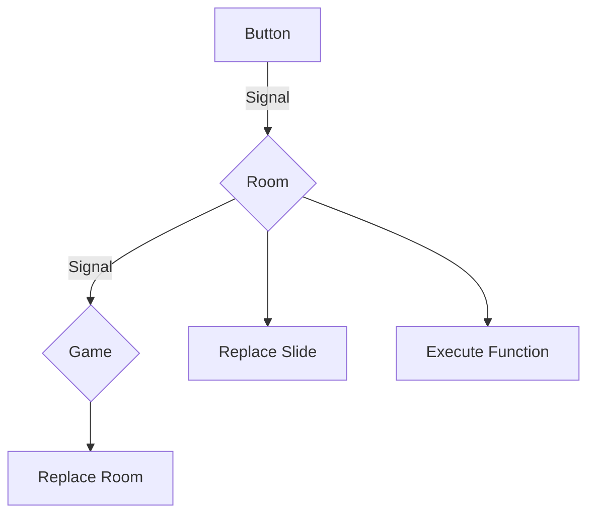

# AdventureFramework2023

## TODO

### Upper Level: Laurin

- Receive Signals
- Room Component Management

### Room Template: Jona

- Navigation, Slides
- CSS

### Utility Functions, Inventory: Dimitri

- Helper Functions (e.g. Write to Inventory, Send to Upper Level)
- Inventory display
- Item list with metadata (name, image, description)

## New TODO

### Laurin

Base classes for Slide and Room, with EventCallbacks and stuff like that

### Jona

Slide Markup, buttons with SVG, CSS stuff

### Dimitri

Continue no Inventory stuff

### How Navigation Works



#### Data Structures

```csharp
public struct Button
{
    public string id { get; }
    public string points { get; }
    public string type { get; }
    public string? method { get; }

    public Button(string id, string points, string type, string? method = null)
    {
        this.id = id;
        this.points = points;
        this.type = type;
        this.method = method;
    }
}

public struct Signal
{
  public string ActionType { get; }
  public string ActionTarget { get; }
  public string[]? args  { get; }

  public Signal(string ActionType, string ActionTarget, string[]? args = null)
  {
    this.ActionType = ActionType;
    this.ActionTarget = ActionTarget;
    this.args = args;
  }
}
```

- `string id`: A unique identifier of the button in the room.

- `string points`: The points for the svg polygon. The points are relative to the svg's size
- `string type`: The type of the button. Can be `"internal"`, `"external"` or `"action"`. Needed for correct routing

  - `"internal"`: The target slide is inside the room.
  - `"external"`: The target slide is in another room.
  - `"action"`: The button does not change the slide, but triggers an action. The `method` field is needed for this. Will raise an error if `method` is `null`.

- `string? method`: The method that is called when the button is clicked. Can be `null`, as often no function call is required. Only neccessary for `"action"` buttons, but can be used for `"internal"` and `"external"` buttons as well, if needed.

`Slide` registers `onclick` event on one of it's buttons

`Slide` sends `Signal` to parent `Room`

`Room` checks in `room.json` if routing is internal or external

If internal, `Room` replaces `Slide` with new `Slide` from `room.json`

If external, `Room` sends Signal to parent (highest level) `Game`

`Game` replaces `Room` with new `Room`-id taken from the room's signal

### Inventory

**All just suggestions, fell free to implement it differently**

#### Data Structures

`Items.json` contains a list of all items with their metadata

```json
{
  "itemID": {
    "name": "Display name of the item",
    "description": "Description of the item (also displayed in inventory)",
    "image": "path/to/image.png"
  }
}
```

`Inventory.json` contains a list with all the items the player has in their inventory

```json
[
  "itemID",
  "item2ID"
]
```

#### Methods

`void addItem(string itemID, int amount=1)` adds `amount` of `itemID` to the inventory

`void removeItem(string itemID, int amount=1)` removes `amount` of `itemID` from the inventory

`bool getItem(string itemID)` returns `true` if `itemID` is in the inventory, `false` otherwise
